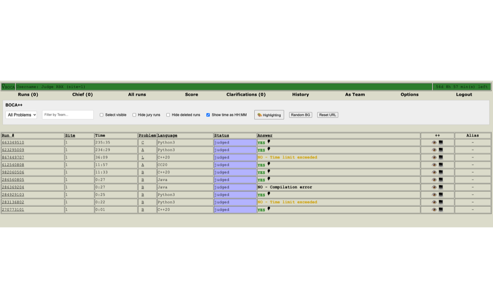
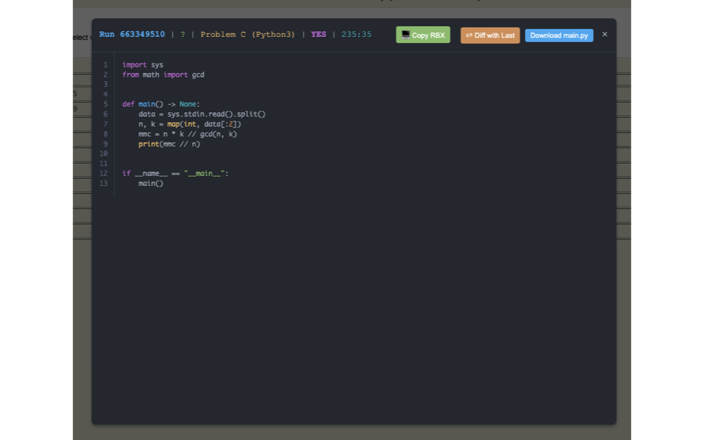

# Boca++

A Chrome extension that enhances the [BOCA](https://github.com/cassiopc/boca)
programming-contest control system's admin and judge interface — a richer runs
table (aliases, reordering, filtering, highlighting) and an inline code viewer
with syntax highlighting and diffs between submissions.

| Enhanced runs table | Inline code viewer |
| --- | --- |
|  |  |

> **Not yet on the Chrome Web Store.** Until it is published, install it manually
> using the steps below — the easiest way is the [release ZIP](#option-1--from-the-release-zip-recommended).
> It only ever runs on a BOCA server you explicitly turn it on for — see
> [Usage](#usage).

---

## Requirements

- Google Chrome, or any Chromium-based browser (Edge, Brave, Vivaldi, …).
- Access to a BOCA server (e.g. `http://your-boca-host/boca/`).

## Install

Chrome can't install a `.zip` (or `.crx`) just by double-clicking it — outside the
Web Store, the only supported way is **Load unpacked** on a folder. So both methods
below end with "Load unpacked"; the difference is just where the folder comes from.

### Option 1 — From the release ZIP (recommended)

This ZIP contains only the extension files, so it's the cleanest option.

**Quickest:** run the installer script (macOS, Linux, or Windows Git Bash / WSL).
It downloads the latest release, unpacks it into a `boca-plusplus/` folder **in the
current directory**, and tells you the one Chrome step left:

```bash
curl -fsSL https://raw.githubusercontent.com/rsalesc/bocapp/main/install.sh | bash
```

Then do steps 3–6 below (Developer mode → Load unpacked → pin), pointing Chrome at
the `boca-plusplus/` folder it created. Keep that folder where it is — Chrome reads
the extension from it. Re-run the command anytime to update. _(Want a different
location? Run `BOCAPP_DIR=/path/to/folder bash install.sh`.)_

**Or do it by hand:**

1. Go to the [**Releases**](https://github.com/rsalesc/bocapp/releases) page and
   download `boca-plusplus-<version>.zip` from the latest release's **Assets**.
2. **Unzip it.** You'll get a folder containing `manifest.json`, `background.js`,
   `libs/`, `icons/`, etc. Keep this folder somewhere permanent — if you delete or
   move it, the extension stops working.
3. Go to `chrome://extensions` and turn on **Developer mode** (toggle, top-right).
4. Click **Load unpacked** and select the **unzipped folder** (the one that
   *directly* contains `manifest.json`).
5. **Boca++** appears in the list. There's **no permission prompt yet** — that's
   expected; access is requested only when you enable it on a server.
6. **Pin it:** click the puzzle-piece **Extensions** button in the toolbar, find
   **Boca++**, and click the pin so the icon stays visible.

### Option 2 — From source

Use this if you want the latest unreleased code or plan to modify it.

1. Get the repository, either by **`< > Code` → Download ZIP** (then unzip) or:
   ```bash
   git clone https://github.com/rsalesc/bocapp.git
   ```
2. Follow steps 3–6 from Option 1, selecting the **repository folder** (the one
   containing `manifest.json`) — **not** the `dist/…zip` inside it.

## Usage

1. Open your BOCA server in the browser (e.g. the admin runs page,
   `http://your-boca-host/boca/admin/run.php`).
2. Click the **Boca++** toolbar icon.
3. Chrome asks for permission to access **that one server** — click **Allow**.
4. The page reloads and the **Boca++** controls appear.

**To turn it off:** click the icon again on that server — it disables and reloads
the page clean.

**To use a different BOCA server:** just click the icon on the new server. It moves
the access over to the new one (the previous server is automatically disabled).

The choice persists across browser restarts, so you only grant access once per
server.

### Where it activates

Boca++ only enhances these BOCA pages (and only on a server you've enabled):

- Runs lists — `admin/run.php`, `judge/run.php`, `judge/runchief.php`, `judge/allrunlist.php`
- Run view/edit — `admin/runedit.php`, `judge/runview.php`, `judge/runedit.php`, `judge/runchiefedit.php`
- Scoreboard — `score.php`

## Updating

When a newer version is available:

1. Refresh the folder Chrome points at — download the new
   [release ZIP](https://github.com/rsalesc/bocapp/releases) and unzip it over the
   old folder, or `git pull` if you installed from source.
2. Go to `chrome://extensions` and click the **reload** ↻ icon on the Boca++ card.
3. Refresh your BOCA tab.

> After a structural change to the extension, a full **Remove** + **Load unpacked**
> is the most reliable way to pick it up cleanly.

## Permissions — what and why

| Permission | Why it's needed |
| --- | --- |
| Host access to a server *(requested on click)* | To read and enhance that server's BOCA pages. Granted per-server, only when you click the icon. |
| `storage` | Remembers which server is enabled, plus local UI preferences (ordering, aliases). |
| `scripting` | Registers the page-enhancing script for the server you enable. |
| `activeTab` | Reads the current tab's URL when you click the icon, to know which server to enable. |
| `clipboardWrite` | Lets you copy values/code from the runs and code-viewer UI. |

Boca++ does **not** collect, transmit, or sell any data. See [PRIVACY.md](PRIVACY.md).

## Troubleshooting

- **Clicking the icon does nothing / shows no prompt.** Make sure you're on an
  `http(s)` BOCA page (not a `chrome://` page). If it still misbehaves after an
  update, do a clean **Remove** + **Load unpacked**.
- **See what the extension is doing.** On `chrome://extensions`, open the Boca++
  card and click the **service worker** link to view its console/log.
- **Controls don't appear after enabling.** Confirm the page is one of the
  [supported pages](#where-it-activates) and that the page finished reloading.

## License / source

Source lives in this repository. Issues and contributions welcome.
